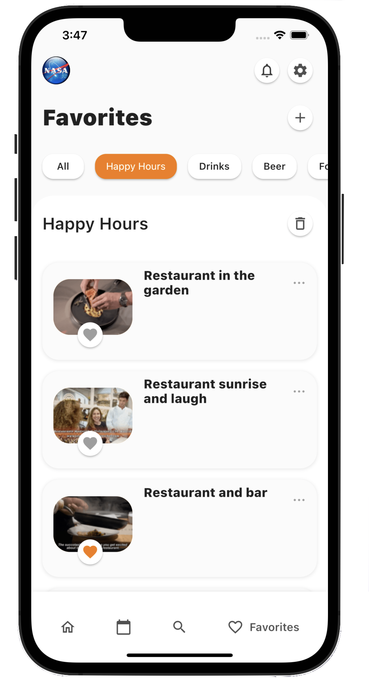
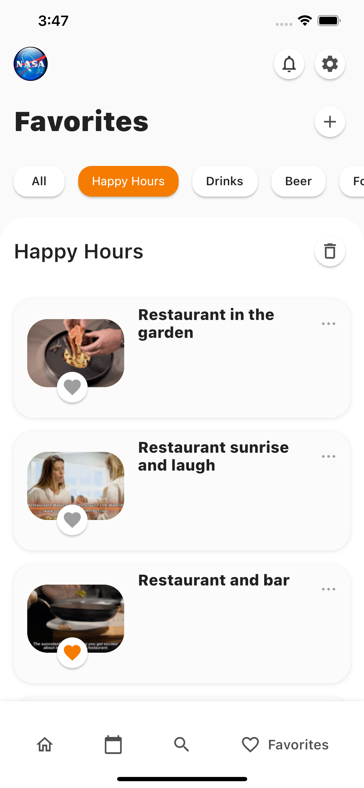

# astronautas

A new Flutter project for my developer test on Tres Astronautas.

# About this project

this version use `null safety` and `flutter_meedu` as state management.

for more info go to https://flutter.meedu.app/docs/4.x.x/intro/

this project uses some freezed class so before run the project
you need to run 
```shell
flutter pub run build_runner build --delete-conflicting-outputs
flutter pub run build_runner watch --delete-conflicting-outputs
```




## Getting Started

This project is a starting point for a Flutter application.

A few resources to get you started if this is your first Flutter project:

- [Lab: Write your first Flutter app](https://flutter.dev/docs/get-started/codelab)
- [Cookbook: Useful Flutter samples](https://flutter.dev/docs/cookbook)

For help getting started with Flutter, view our
[online documentation](https://flutter.dev/docs), which offers tutorials,
samples, guidance on mobile development, and a full API reference.
